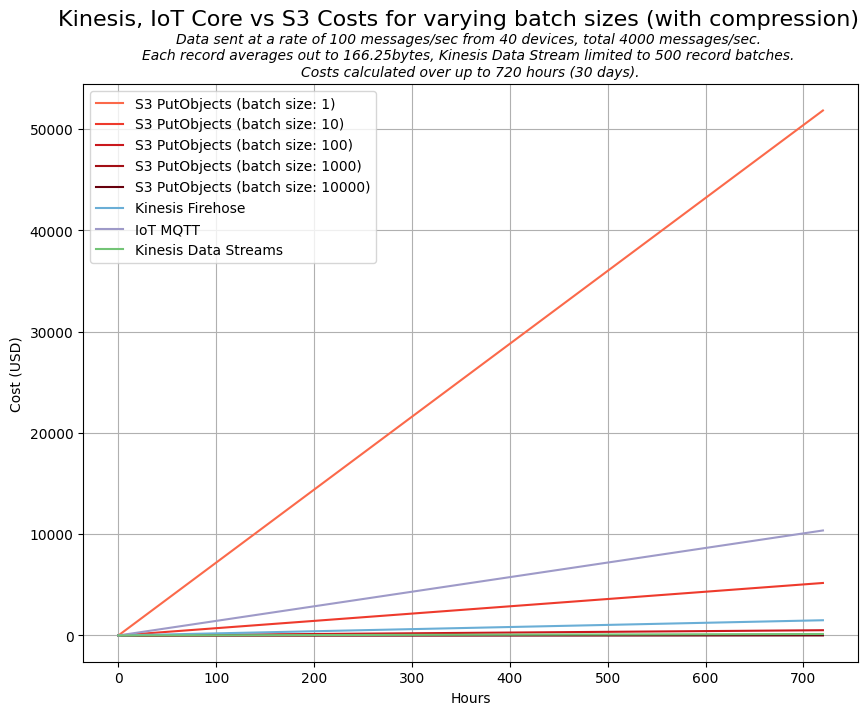
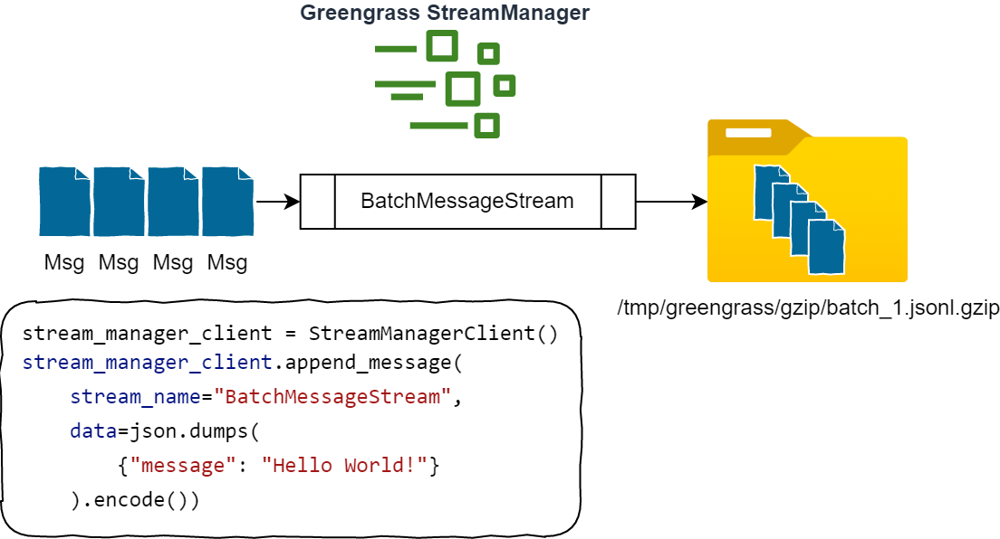
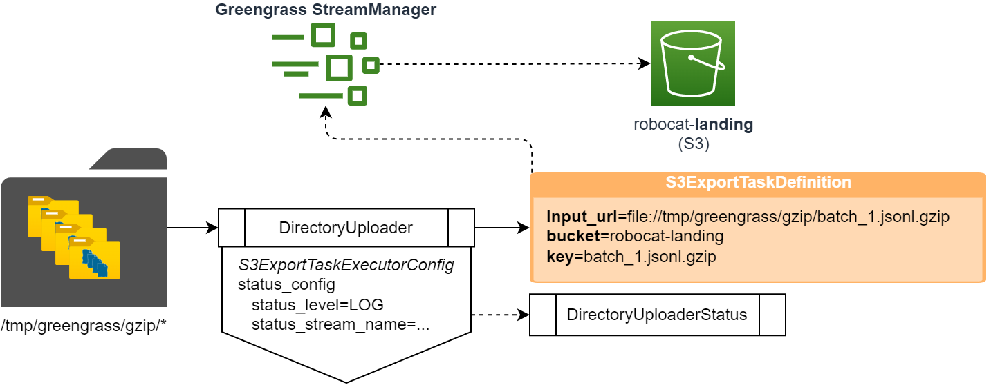
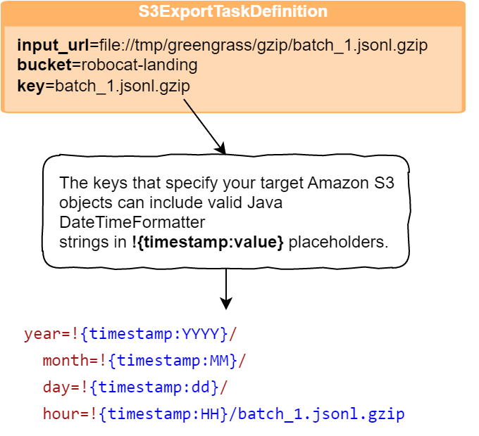
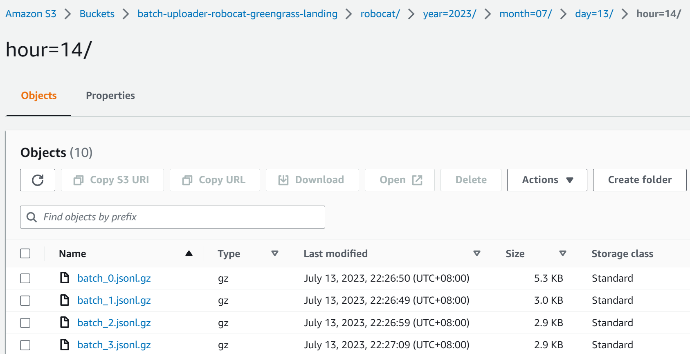
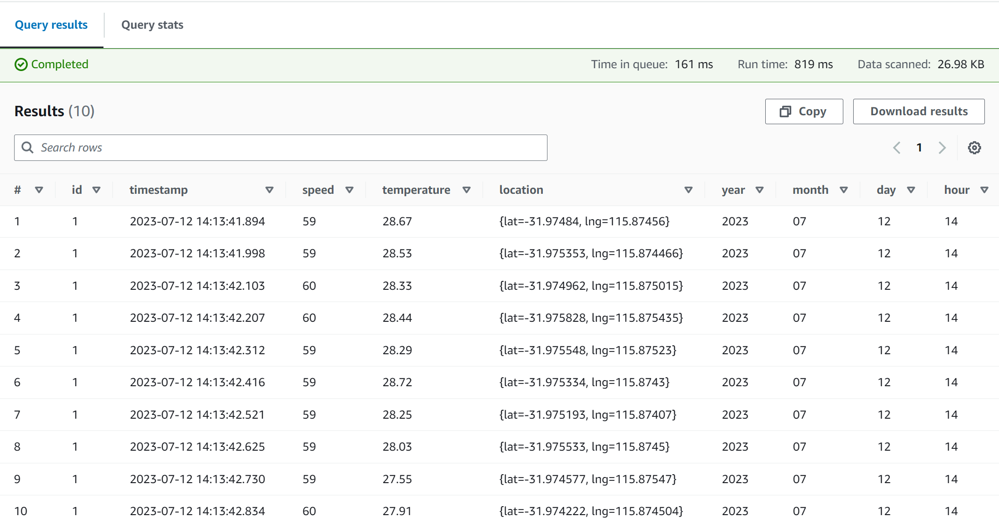

# Greengrass Batch To S3 Component

This component takes a stream of JSON messages from StreamManager and batches them into a gzip file. It uses a JSON Line (JSONL) format for the messages.

## Purpose

When deciding on the best way to upload data from a device to the cloud, one of the most important considerations is the cost of the data transfer. This component is designed to reduce the cost of data transfer by batching and compressing the data before uploading it to the cloud. It aims to be as cheap if not cheaper than using the current recommended approach to batch uploading of data using Kinesis Data Streams or Kinesis Firehose.

Below is a high-level cost comparison that provides some context as to why this component was created.



Similarly, another scoped-down comparison between just Kinesis Data Streams and batched then compressed uploads to S3.


To remain competitive with Kinesis Data Streams, the batch size needs to be at least 1000 messages. This is because Kinesis Data Streams charges per shard hour and each shard can handle up to 1000 messages per second. If the batch size is less than 1000 messages, then the cost of using Kinesis Data Streams will be less than using this component.

### What it is

- This component is designed to be used with the [StreamManager](https://docs.aws.amazon.com/greengrass/v2/developerguide/stream-manager-component.html) component.
- Decouples cheap data ingestion from Kinesis and delivers data directly to S3 in:
  - A compressed format (gzip)
  - Pre-partitioned by year, month, day and hour so that it can be easily queried using Athena or another query engine.

### What it is not

- This component is not designed to be a solution for use cases where data needs to be delivered to the Cloud in real-time. By design, data is batched and compressed before being uploaded to S3. This means that there will be a lag between the data being generated and it being available in S3.

## How it works

There are three main steps to the process:

- **BatchMessageProcessor** - This component takes a stream of JSON messages from StreamManager and batches them into a gzip file. It uses a JSON Line (JSONL) format for the messages. It is configured with the following parameters:
  - **StreamName** - The name of the StreamManager stream that the component will read from - in the example below, this is `BatchMessageStream`.
  - **BatchSize** - The minimum number of messages that will be batched into a gzip file. If there are not enough messages in the stream, the gzip file will not be created.
  - **Interval** - The interval in seconds that the component will check for new messages in the stream.
  - **Path** - The path to the folder where the gzip files will be written to.

  ---

  

  ---

- **DirectoryUploader** - This component will monitor a directory for new files and upload them to S3. It is configured with the following parameters:
  - **BucketName** - The name of the S3 bucket that the files will be uploaded to.
  - **Prefix** - The prefix that will be added to the file name when it is uploaded to S3.
  - **Interval** - The interval in seconds that the component will check for new files in the directory.
  - **Path** - The path to the folder where the gzip files will be written to.

  The DirectoryUploader component leverages [S3ExportTaskExecutorConfig](https://docs.aws.amazon.com/greengrass/v2/developerguide/stream-export-configurations.html#export-to-s3) to offload the upload of the files to S3 to the StreamManager service.

  ---

  
  
  ---

  This feature of StreamManager comes with several benefits:

  - Managed multi-part upload to S3 asynchronously outside of our component's code.
  - Destination key prefix based on the current time using Java DateTimeFormatter patterns.

  ---

  

  ---

- The S3ExportTaskExecutorConfig task is sent with a `status_stream_name` which is used to send the status of the upload back to the component. The status stream is monitored by the DirectoryUploader component and when a status message is received that indicates that the upload has completed, the file is deleted from the device.

  ---

  

  ---

## How is this useful?

When the data lands in S3 is it partitioned by year, month, day and hour. This makes it easy to query the data using Athena or another query engine to quickly get insights into the data.



Below is an example of how data landed in S3 after being uploaded by this component can be queried in Athena.

```sql
CREATE EXTERNAL TABLE IF NOT EXISTS greengrass_data (
    `id` string,
    `timestamp` timestamp,
    `speed` int,
    `temperature` float,
    `location` struct<lat:float, lng:float>
)
PARTITIONED BY (`year` string, `month` string, `day` string, `hour` string)
ROW FORMAT SERDE 'org.apache.hive.hcatalog.data.JsonSerDe'
WITH SERDEPROPERTIES ( "timestamp.formats"="yyyy-MM-dd'T'HH:mm:ss.SSSSSSZZ" )
LOCATION 's3://batch-uploader-robocat-greengrass-landing/robocat/'
```

Then we can query the data in its raw form:

```sql
-- Required to load new partitions if new data has been uploaded
MSCK REPAIR TABLE `greengrass_data`;
SELECT * FROM "greengrass_data" limit 10;
```



This is a very simple example, but it shows how easy it is to query the data in S3. There is a lot more that can be done such as processing the landed data into Apache Iceberg, which is another data lake engine that removes the need for dealing with partitions along with some other fancy features. This is something not covered in this example, but I will be presenting the solution at [DataEngBytes Perth](https://dataengconf.com.au/) on the 22nd of August 2023.

## Sample Configuration

By default, this component will take the JSON message stream from the `BatchMessageStream` stream and batch it into a gzip file every 30 seconds. If configured with `gzip` as the output folder, the gzip files will be written to `/greengrass/v2/work/com.devopstar.json.gzip/gzip/` on the device - This might change depending on the installation path of Greengrass.

The BatchSize configuration is the minimum number of messages that will be batched into a gzip file. If there are not enough messages in the stream, the gzip file will not be created.

The Maximum number of messages that will be batched into a gzip file is 10 times the BatchSize.

### YAML example

```yaml
ComponentDependencies:
  aws.greengrass.StreamManager:
    VersionRequirement: "^2.0.0"
    DependencyType: "HARD"
ComponentConfiguration:
  DefaultConfiguration:
    Processor:
      StreamName: "BatchMessageStream"
      BatchSize: "20"
      Interval: "30"
      Path: "/tmp/greengrass/gzip"
    Uploader:
      BucketName: "my-bucket"
      Prefix: "sample-devices"
      Interval: "1"
      Path: "/tmp/greengrass/gzip/*"
    LogLevel: "INFO"
```

### JSON example

```json
{
  "ComponentDependencies": {
    "aws.greengrass.StreamManager": {
      "VersionRequirement": "^2.0.0",
      "DependencyType": "HARD"
    }
  },
  "ComponentConfiguration": {
    "DefaultConfiguration": {
      "Processor": {
        "StreamName": "BatchMessageStream",
        "BatchSize": "20",
        "Interval": "30",
        "Path": "/tmp/greengrass/gzip"
      },
      "Uploader": {
        "BucketName": "my-bucket",
        "Prefix": "sample-devices",
        "Interval": "1",
        "Path": "/tmp/greengrass/gzip/*"
      },
      "LogLevel": "INFO"
    }
  }
}
```

## Development & Testing

```bash
python3 -m venv .venv
source ./.venv/bin/activate
pip3 install -r requirements-dev.txt
pytest
```

## Publish Component

```bash
gdk component build
gdk component publish
```

## Roadmap

- [ ] August 2023 | Generalize the component to allow for different input and output formats. Right now this component only supports JSONL input and gzip output. I plan to rename this component to `greengrass-batch-to-s3 - com.devopstar.batch.to.s3` once I've confirmed that multiple inputs and outputs are feasible and worth doing. An example of an output format that I would like to support is Parquet.
- [ ] August 2023 | Remove the need for specifying the Path and Interval twice. Right now the Path and Interval are specified in the Processor and Uploader sections of the configuration. I would like to remove the need for this duplication.
- [ ] August 2023 | CI/CD pipeline for automated deployment of the component versions to my AWS account.
- [ ] September 2023 | Integrate [AWS Greengrass test framework](https://github.com/aws-greengrass/aws-greengrass-testing) into the CI/CD pipeline.
