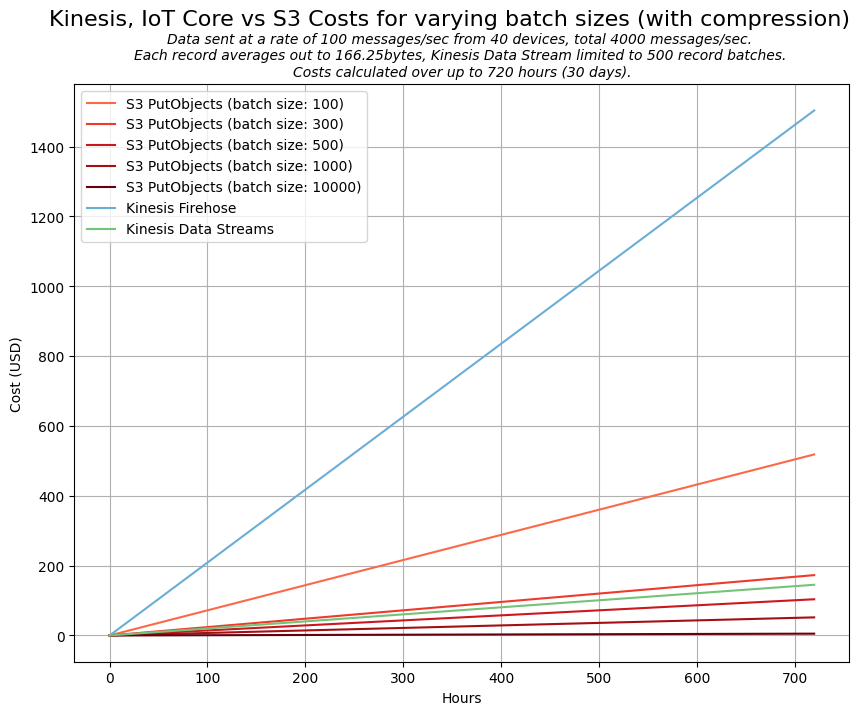

# StreamManager JSON Gzip Component

This component takes a stream of JSON messages from StreamManager and batches them into a gzip file. It uses a JSON Line (JSONL) format for the messages.

## Purpose

When deciding on the best way to upload data from a device to the cloud, one of the most important considerations is the cost of the data transfer. This component is designed to reduce the cost of data transfer by batching and compressing the data before uploading it to the cloud. It aims to be as cheap if not cheaper than using the current recommended approach to batch uploading of data using Kinesis Data Streams or Kinesis Firehose.

Below is a high level cost comparison that provides some context as to why this component was created.


Similarly, another scoped down comparision between just Kinesis Data Streams and batched then compressed uploads to S3.



### What it is

- This component is designed to be used with the [StreamManager](https://docs.aws.amazon.com/greengrass/v2/developerguide/stream-manager-component.html) component.
- Decouples cheap data ingestion from Kinesis and delivers data directly to S3 in:
  - A compressed format (gzip)
  - Pre-partitioned by year, month, day and hour so that it can be easily queried using Athena or another query engine.

### What it is not

- This component is not designed to be a solution for use cases where data needs to be delivered to the Cloud in real-time. By design, data is batched and compressed before being uploaded to S3. This means that there will be a lag between the data being generated and it being available in S3.

## Sample Configuration

By default this component will take the JSON message stream from the `BatchMessageStream` stream and batch it into a gzip file every 30 seconds. If configured with `gzip` as the output folder, the gzip files will be written to `/greengrass/v2/work/com.devopstar.json.gzip/gzip/` on the device - This might changes depending on the installation path of Greengrass.

The BatchSize configuration is the minimum number of messages that will be batched into a gzip file. If there are not enough messages in the stream, the gzip file will not be created.

The Maximum number of messages that will be batched into a gzip file is 10 times the BatchSize.

**YAML example**
```
ComponentDependencies:
  aws.greengrass.StreamManager:
    VersionRequirement: "^2.0.0"
    DependencyType: "HARD"
ComponentConfiguration:
  DefaultConfiguration:
    Processor:
      StreamName: "BatchMessageStream"
      BatchSize: "20"
      Interval: "30"
      Path: "/tmp/greengrass/gzip"
    Uploader:
      BucketName: "my-bucket"
      Prefix: "sample-devices"
      Interval: "1"
      Path: "/tmp/greengrass/gzip/*"
    LogLevel: "INFO"
```

**JSON example**
```json
{
  "ComponentDependencies": {
    "aws.greengrass.StreamManager": {
      "VersionRequirement": "^2.0.0",
      "DependencyType": "HARD"
    }
  },
  "ComponentConfiguration": {
    "DefaultConfiguration": {
      "Processor": {
        "StreamName": "BatchMessageStream",
        "BatchSize": "20",
        "Interval": "30",
        "Path": "/tmp/greengrass/gzip"
      },
      "Uploader": {
        "BucketName": "my-bucket",
        "Prefix": "sample-devices",
        "Interval": "1",
        "Path": "/tmp/greengrass/gzip/*"
      },
      "LogLevel": "INFO"
    }
  }
}
```

## Development & Testing

```bash
python3 -m venv .venv
source ./.venv/bin/activate
pip3 install -r requirements-dev.txt
pytest
```

## Publish Component

```bash
gdk component build
gdk component publish
```
